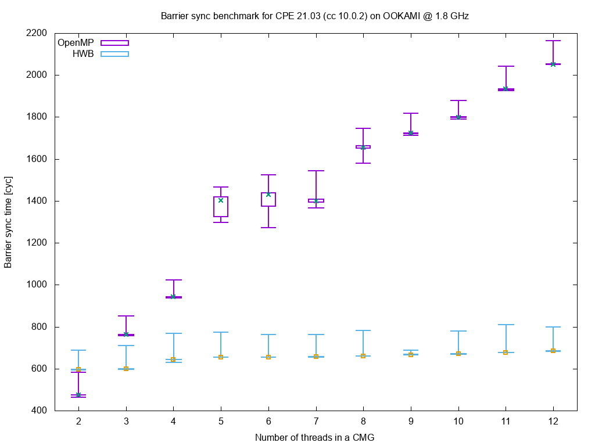

# A64FX Hardware Barrier

This folder contains the kernel module (`kmod`) and [user-space library](https://github.com/fujitsu/hardware_barrier) (`ulib`) for the A64FX hardware barrier. The intention of this module is not to provide the most flexible API but to play nicely together with Fujitsu's library.

Each CMG (core-memory-group) contains 6 barrier blades. Each PE (hardware thread) provides 4 barrier window registers. The registers for the A64FX HWB are documented in the [A64FX HPC Extension](https://github.com/fujitsu/A64FX/blob/master/doc/A64FX_Specification_HPC_Extension_v1_EN.pdf) ([Japanese version](https://github.com/fujitsu/A64FX/blob/master/doc/A64FX_Specification_HPC_Extension_v1_JP.pdf)).

# A64FX HWB scheme
1.  **Initialize BBs**
    Assing PEs to one of the BB in CMG
    ```
      |     +-----+ +-----+ +-----+ +-----+ +-----+ +-----+
      |     | BB0 | | BB1 | | BB2 | | BB3 | | BB4 | | BB5 |
      |     +-----+ +-----+ +-----+ +-----+ +-----+ +-----+
    CMG      ^        ^       ^        ^       ^       ^
      |      | _______|_______|________|_______|_______|
      |      |/
      |     PE[0-12]
    ```
    by using `write_init_sync_bb(int blade, unsigned long bst_mask)` and setting all BST bits initially to `0`.
2.  **Assign WRs**
    Assign WRs so that a window maps to a BB
    ```
      |     +-----+
    CMG     | BBx |
      |     +-----+
               ^
               |________________________
               |       |       |       |
      |     +-----+ +-----+ +-----+ +-----+
    PE      | WR0 | | WR1 | | WR2 | | WR3 |
      |     +-----+ +-----+ +-----+ +-----+
    ```
    by using `write_assign_sync_wr(int window, int valid, int blade)`
3.  **Do work**
    Each PE processes its workload.
4.  **Set BST for each finished PE**
    When a PE is finished, read `LSBY`, invert it and write its updated BST bit.
    ```
      |    +--------------------------------------------------------+
    CMG    |     RES0     | BST_MASK | RES0 | LBSY | RES0 |   BST   |
      |    +--------------------------------------------------------+
                                               ^
      |                                        |    (invert)
    PE                                         0x ==========> 0x1
      |                                                        | (based on PE id)
                                                              \/
      |    +--------------------------------------------------------+
    CMG    |     RES0     | BST_MASK | RES0 | LBSY | RES0 |   BST   |
      |    +--------------------------------------------------------+
    ```
    This could be done in `kmod` by using `read_bst_sync_wr(int window, int* sync)` and `write_bst_sync_wr(int window, int sync)`.
    `LSBY` gets updated based on all participating `BST` bits defined by `BST_MASK` and is set to
    `0x1` when all participating `BST` bits are `0x1`.
5.  **Check if HWB is done**
    Read out `LSBY` and check if it is equal to the local BST bit (i.e., `0x1`) with `read_bst_sync_wr(int window, int* sync)`.
    Repeat this step as long as check was unsuccessful.

For user-space applications, the `ulib` performs the steps 4 and 5 with a single call to `fhwb_sync()`.

# Sysfs interface
The `ulib` contains a description of the [sysfs interface](https://github.com/fujitsu/hardware_barrier/blob/develop/sysfs_interface.md) that should be provided by the kernel module. All required files and folders are exported by `kmod`.

# Developement and test system
The development of `kmod` and its testing was performed on a node of the OOKAMI cluster are Stony Brook University:

> The authors would like to thank Stony Brook Research Computing and Cyberinfrastructure, and the Institute for Advanced Computational Science at Stony Brook University for access to the innovative high-performance Ookami computing system, which was made possible by a $5M National Science Foundation grant (#1927880).

# Get it

```
$ git clone --recursive-subdirs git@github.com:RRZE-HPC/A64FX_HWB_kmod.git
$ cd A64FX_HWB_kmod/kmod
$ make
$ sudo insmod modules/a64fx_hwb.ko
```

# Measurements
After the implementation, we benchmarked the HWB in comparison to the OpenMP barrier implementations of GCC 11.2.0 and CPE 21.03 (cc 10.0.2) on OOKAMI. The benchmark code can be found in the `benchmark` folder. It is a syntethic benchmark measuring only the best-case.





# Differences to the Fujitsu hardware barrier module
At first, I have never seen Fujitsu's implementation so this is based on the README of the [user-space library](https://github.com/fujitsu/hardware_barrier):

* "After fhwb_assign(), BST_SYNC/LBSY_SYNC register becomes accessible from EL0"
> This kernel module enables the EL0 access at module load and disables it at module unload

* The library header file lists which errors are returned by which function
> This kernel module uses different error codes but always returns negative values in case of errors.
